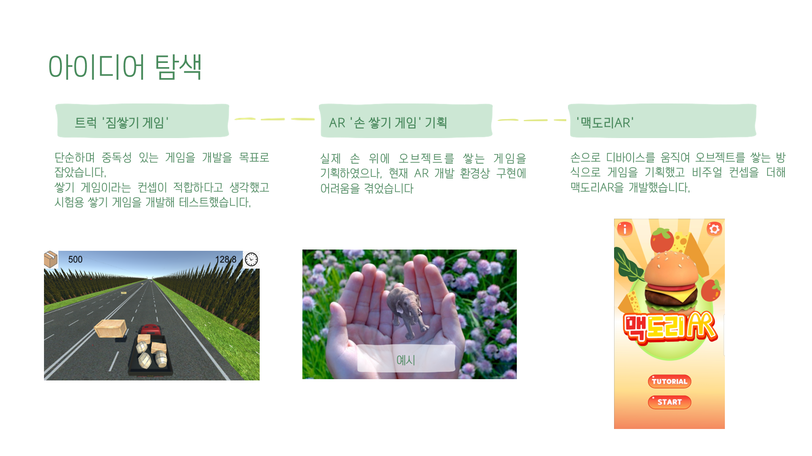

맥도리AR
===

#### 구현 영상 및 참고
https://www.notion.so/AR-9623ef77a6744a7cb224867251d1d374

## 소개
모바일 디바이스를 조리도구처럼 잡고 움직이며 요리를 만드는 햄버거 타이쿤 게임

</img>

## 개발동기
단지 게임에 AR이 추가된 게임이 아니라, AR이기 때문에 할 수 있는 게임을 개발하고자했다.
그리고 실험적인 개발이 아니라 완성된 앱을 제작하고자 했다

</img>

## 특징
</img>

- 게임을 시작한 뒤에 Plane Detetion후에 원하는 위치에 주방을 배치할 수 있다
- 디바이스를 조리도구처럼 잡고 움직일 수 있도록 조리도구 오브젝트를 AR Camera의 자식으로 붙이고 디바이스를 움직여 원하는 재료에 가져가면 해당 재료에 어울리는 조리도구로 바뀌면서 재료를 쌓을 수 있고 이를 반복하여 햄버거를 완성할 수 있다
- 요리 재료 및 레시피와 랭킹등의 데이터를 json 등과 같은형태로 저장하여 쉽게 접근하고 수정할 수 있다.
- 레시피에 랜덤으로 재료를 추가, 제거하여 기존에 없는 새로운 레시피의 주문이 들어 올 수 있다
- GameManger.cs, PickIngredient.cs, PlayUIManager.cs, Rank.cs, RecipeDisplay.cs, EffectPlayer.cs 등 스크립트를 기능별로 구분하여 프로젝트를 개발했다
- Collaborate를 사용하여 협업을 진행했다

## WBS
</img>

## 플레이 과정
</img>

## 화면 소개
</img>
</img>